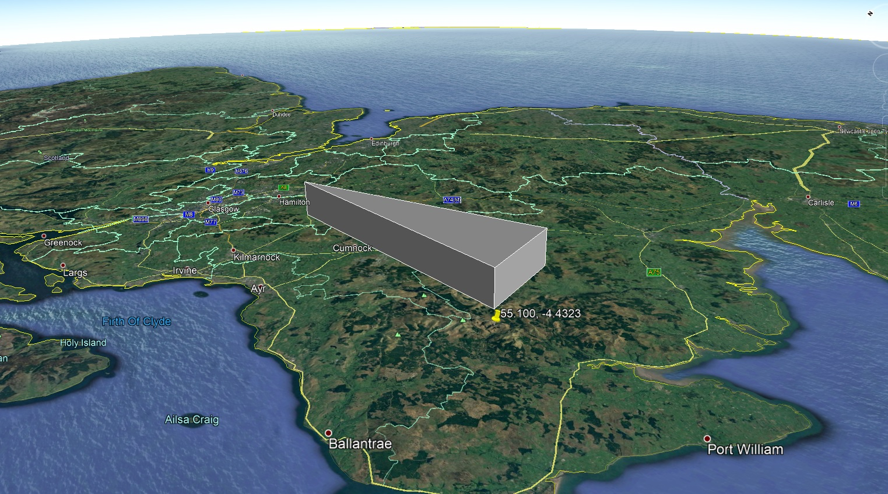
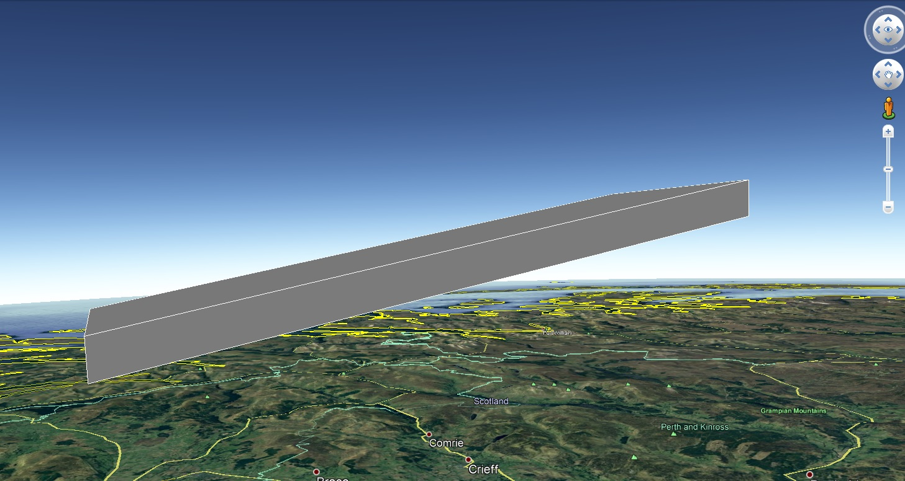

KML+
===


KML+ (KMLPlus) is library of code for Python which allows the user to easily create standard and 'floating' Polygons,
Circles and Arcs.

---

Table of Contents
-----------------

1. [Who is this for](#who-is-this-for)
2. [Installing](#installing)
3. [Usage](#usage)
    - [Recommendations](#recommendations)
    - [Quick Start](#quick-start)
4. [Classes](#classes)
    - [Coordinate](#coordinate)
    - [LinePath](#linepath)
        - [Creating a polygon using the LinePath class](#creating-a-polygon-using-the-linepath-class)
        - [Automatically create LinePath objects without Coordinate objects](#automatically-create-linepath-objects-without-coordinate-objects)
    - [ArcPath](#arcpath)
5. [Acknowledgements](#acknowledgements)

---

Who is this for
---------------

This is for anyone who wishes to easily render polygons, especially 'floating' or curved polygons within Google Earth.

I work in the aviation industry and needed a reliable way to create models of our airspace. It its useful for creating
models of airways and controlled airspace. It can be used for anything that takes your fancy!


---

Installing
----------

### Pip

```
pip install kmlplus
```

### Clone

```
git clone https://github.com/MHenderson1988/kmlplus.git

# Or

git clone git@github.com:MHenderson1988/kmlplus.git
```

### Running tests

```
python -m unittest
```

---

Usage
-----

### Recommendations

KML+ easily integrates with the fantastic [Simplekml](https://pypi.org/project/simplekml/) library and I highly
recommend using it in conjunction with KML+ for the best experience.

Take a look at the example .py file provided to see how KML+ integrates with SimpleKML to create airspace
representations from CAA AIP supplied data.

---

### Quick Start

The simplest way to create a standard 'level' floating polygon

```bazaar
import simplekml
from kmlplus import paths

# Auto generate a linepath polygon from a list of string representations of coordinates in latitude, longitude, height
# format.  Can be a mix of DMS and decimal.  Make sure the last and first coordinate are the same, otherwise the
# Polygon will not complete
list_of_coordinates = ["55.123, -4.123", "55.600, -41232.12", "55.100, -4.4323", "55.123, -4.123"]

# Pass the list to the LinePath constructor.  You can override the height at this point with the 'height' kwarg.
lower_layer, upper_layer, sides = paths.LinePath(*list_of_coordinates, lower_height=3000, upper_height 8000)


# Use simplekml to create the .kml
def create_kml():
    kml = simplekml.Kml()
    fol = kml.newfolder(name='Quick start example')

    pol = fol.newpolygon()
    pol.outerboundaryis = lower_layer
    pol.altitudemode = simplekml.AltitudeMode.relativetoground

    pol = fol.newpolygon()
    pol.outerboundaryis = upper_layer
    pol.altitudemode = simplekml.AltitudeMode.relativetoground

    for item in sides:
        pol = fol.newpolygon()
        pol.outerboundaryis = item
        pol.altitudemode = simplekml.AltitudeMode.relativetoground

    kml.save('Quick start example.kml')


if __name__ == "__main__":
    create_kml()
```



For 'sloped' polygons, you need to manually specify the coordinates, so as not to override height values.

```bazaar
import simplekml
from kmlplus import paths

"""
Creating a sloped polygon using the create_layer_and_sides method.  When creating a sloped polygon you will need to
determine the coordinates manually.  The blanket 'height' key word argument will cause all to default to a single value
and will result in a 'level' polygon.
"""

list_of_coordinates_lower = ["56.11, -4.33, 5000", "56.88, -4.33, 20000", "56.88, -4.88, 20000", "56.11, -4.88, 5000"]
list_of_coordinates_upper = ["56.11, -4.33, 10000", "56.88, -4.33, 25000", "56.88, -4.88, 25000", "56.11, -4.88, 10000"]

lp_1 = paths.LinePath(*list_of_coordinates_lower)
lp_2 = paths.LinePath(*list_of_coordinates_upper)
sloped_sides = lp_1.create_sides(lp_2)
```



---

Classes
---

KML+ comprises three classes -

- Coordinate class
- LinePath class
- ArcPath class

The user should be able to create simple floating polygons without touching the ArcPath class however it is documented
here in case you should wish to use it in other ways.

***

## Coordinate

```bazaar
Coordinate(**args, name=None, arc_direction=None, arc_origin=None*)
```

The Coordinate class accepts up to three arguments - latitude, longitude and height. This can be given as either one
string or three separate arguments. Latitude and longitude must be either decimal coordinates or degrees minutes
seconds (DMS). The coordinate object will auto-detect the coordinate type and will automatically convert DMS coordinates
to kml readable decimal coordinates.

Coordinate instances can also be designated as the start point of a clockwise or anti-clockwise arc/circle. This is
achieved by appending either 'a' or 'c' to end of the latitude or longitude value.

Examples -

```bazaar
from kmlplus import coordinates

# A standard coordinate object with a default height of 0
c1 = coordinates.Coordinate(55.123, -4.1234)

# The same coordinate initialised with a height of 50m
c1 = coordinates.Coordinate(55.123, -4.1234, 50)

# Now with a string
c1 = coordinates.Coordinate("55.123, -4.1234")

# Specifying that this coordinate is the start of a clockwise 'arc'
c1 = coordinates.Coordinate(55.123, '-4.1234c')

# You can combine coordinate types
c1 = coordinates.Coordinate(55.123, '-41232.327847834c')
```

A note on arcs -

* Values must be passed as a String eg - "55.22132c" is valid, 55.22132c will throw an error

* If kwarg arc_origin is not passed, it will default to the centroid of the LineString created later on.

### Methods

generate_coordinates(distance=10, bearing=10, height=0) takes 3 key word arguments of distance(in Km), bearing and
height. It returns a new Coordinate object representing the location specified from the Coordinate object calling the
function

```bazaar
c1 = coordinates.Coordinate(55.123, -4.123, 0)
c2 = c1.generate_coordinates(10, 180, 0)

print(c2)

>> 55.03317, -4.123, 0.0
```

get_bearing_and_distance(a_coordinate_object) takes one other Coordinate object as its argument. It returns the distance
and bearing FROM the argument to the object calling the method.

```bazaar
c1 = coordinates.Coordinate(55.123, -4.123, 0)
c2 = c1.generate_coordinates(50, 180, 0)
bearing, distance = c2.get_bearing_and_distance(c1)

print(bearing, distance)

>> 180.0 50.0
```

to_string_yx accepts no arguments and returns a string in Latitude, Longitude format.

```bazaar
c1 = coordinates.Coordinate(55.11213, -4.24453)
print(c1.to_string_yx())

>> 55.11213, -4.24453
```

kml_tuple() accepts no arguments and returns a Tuple readable by .kml (Longitude, Latitude, height)

```bazaar
c1 = coordinates.Coordinate("55.23231c, -552312")
print(c1.kml_tuple())

>> (-55.38667, 55.23231, 0.0)
```

***

## LinePath

The LinePath class takes Coordinate objects or lists of Coordinate objects as its arguments. If a Coordinate object
defines itself as the start of a clockwise or anticlockwise arc, the LinePath class will call an ArcPath instance. This
will automatically create the required arc as part of the LinePath objects coordinates.

```bazaar
LinePath(*args, sort=False, height=None, arc_points=50, origin = self.centroid*)
```

*args must all be instances of Type Coordinate.

*sort=True* will sort the Coordinate objects into anticlockwise order around the polygon's centroid therefore allowing
correct rendering by Google Earth. This is experimental and is highly unlikely to work with concave polygons.

*height=float or int* will override all height values in the Coordinate arguments.

*arc_points=int* will define how many coordinates should be created for any detected arcs/circles.

*origin=Coordinate* details the origin for all ArcPaths automatically generated by the LinePath. Defaults to the
LinePath centroid.

```bazaar
from kmlplus import paths
my_line_path = paths.Linepath(coordinate_1, coordinate_2, *arcpath_1)
```

If a coordinate is detected with an arc suffic 'c' or 'a', the LinePath will automatically call the ArcPath class and
populate the arc coordinates.

### Creating a polygon using the LinePath class

**Note** - LinePath.sides has been deprecated since 2.0. You can now create the sides using the .create_sides() method
which returns a list. Or call .create_layer_and_sides() method to create an upper layer and the sides simultaneously

Once you have created the lower layer of your polygon, you can interpolate the upper layer and generate the sides by
calling the create_layer_and_sides() method -

```bazaar
my_line_path = paths.Linepath(coordinate_1, coordinate_2, *arcpath_1)
upper_layer, sides = my_line_path.create_layer_and_sides(height=height_for_upper_layer, origin=ArcPath_origin_coordinates)
```

### Automatically create LinePath objects without Coordinate objects.

LinePaths and their Coordinate instances can be automatically created from a list, as in the example file provided.

```bazaar
frz_ref_point = coordinates.Coordinate(55.509392, -4.594581)
cta_1 = [
    "554023,-45040", "553734,-44227a", "552811,-44906", "553124,-45830", "554023,-45040"
]

def create_polygon(a_list, lower_height, upper_height, arc_origin, **kwargs):
    lp = paths.LinePath(*a_list, height=lower_height, origin=arc_origin)
    lp2, sides = lp.create_layer_and_sides(height=upper_height, origin=arc_origin)
    return lp, lp2, sides
```

## ArcPath

```bazaar
ArcPath(*origin, start_bearing, end_bearing, radius, height=self.origin.height, direction='Clockwise', points=50*)
```

ArcPath objects are used to create a series of Coordinate objects to simulate a circle or arc which starts and ends on a
specified bearing from a specified origin at a given radius. They can be 'Clockwise' or 'Anticlockwise' and return as
many or as few 'points' as desired.

## Acknowledgements

- [Simplekml](https://pypi.org/project/simplekml/) - for creating an awesome library which has helped me create many
  things and also inspiring me to write this library.`


