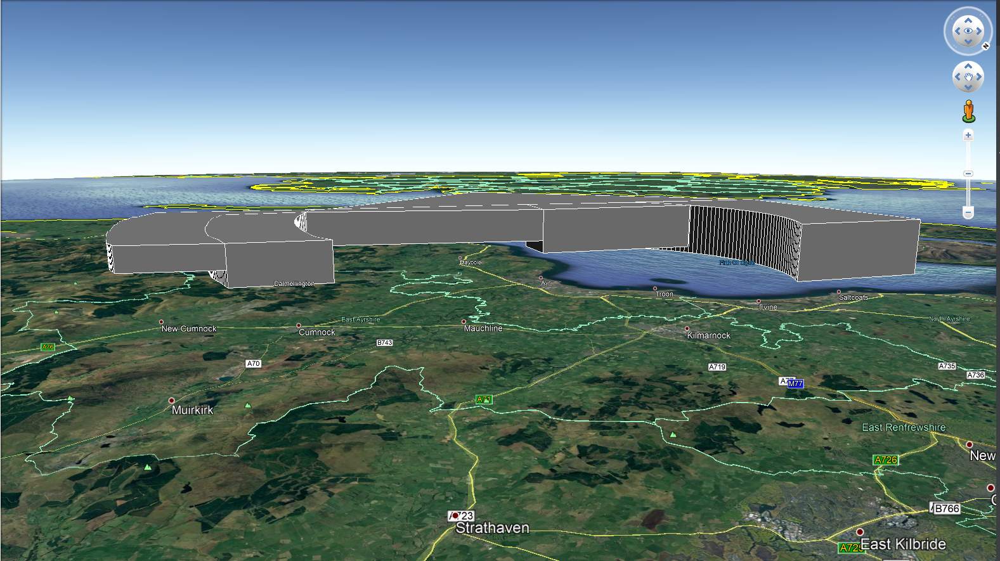
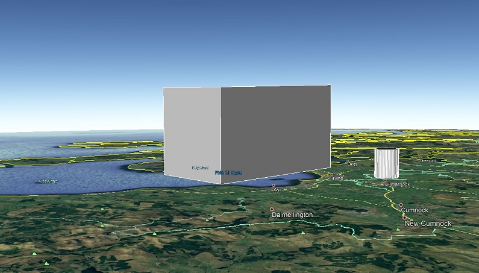

KML+
===

KML+ (KMLPlus) is library of code for Python which allows the user to easily process_points standard and 'floating'
Polygons, Circles and Arcs.

---

Table of Contents
-----------------

1. [Who is this for](#who-is-this-for)
2. [Installing](#installing)
3. [Usage](#usage)
    - [Recommendations](#recommendations)
    - [Coordinates](#coordinates)
    - [Coordinates containing Arcs](#coordinates-containing-arcs)
4. [Classes and functions](#classes-and-functions)
    - [KmlPlus](#kmlplus-class)
        - [KmlPlus (functions)](#kmlplus-functions)
            - [linestring](#linestring)
            - [polyhedron](#polyhedron)
            - [circle](#circle)
            - [cylinder](#cylinder)
            - [point](#point)
5. [Acknowledgements](#acknowledgements)

---

Who is this for
---------------

This is for anyone who wishes to easily render polygons, especially 'floating' or curved polygons within Google Earth.

I work in the aviation industry and needed a reliable way to process_points models of our airspace. It its useful for
creating models of airways and controlled airspace. It can be used for anything that takes your fancy!





---

Installing
----------

### Pip

```
pip install kmlplus==2.1.0  <--- last stable release
pip install kmlplus==3.0.0b5 <--- Current v3.0.0-beta.5
```

### Clone

```
git clone https://github.com/MHenderson1988/kmlplus.git

# Or

git clone git@github.com:MHenderson1988/kmlplus.git
```

### Running tests

```
python -m unittest
```

---

Usage v3
-----

### Recommendations

KML+ easily integrates with the fantastic [Simplekml](https://pypi.org/project/simplekml/) library and I highly
recommend using it in conjunction with KML+ for the best experience.

#### Coordinates

Coordinates should always be passed as a single or multiple strings within a list in x, y, z(optional) format. Both
Degrees Minutes Seconds (DDMMSS.ss) and Decimal Degres (DD.dd) are accepted. DMS should be suffixed with N, W, S or E.
Decimal degrees are suffixed using -/+ convention.

While a coordinate string must be passed using the same type of coordinate, lists can contain a mixture of DMS and DD
coordinates and will convert appropriately.

If no z value is provided, defaults to 0.0.

Example

```
[
    '553124N 0045830W',
    '552040N 0042722W',
    '551848N 0044702W',
    '553124N 0045830W'
]
```

#### Coordinates containing Arcs

When creating a curved segment of a polygon, the string should be passed as follows -

'start=[starting_coordinate], end=[ending_coordinate], centre=[centre_coordinate], direction=[clockwise/anticlockwise]'

Example -

```
[
     'start=54.32111 -3.98721, end=54.13447 -3.89329, centre=54.31667 -3.41806, direction=anticlockwise',
     '54.13444 -3.89333',
     '54.17417 -4.14556',
     'start=54.17418 -4.14551, end=54.23696 -4.17352, centre=54.31667 -3.41806, direction=clockwise',
     '54.23694 -4.17361',
     '54.32111 -3.98722',
]
```

### Classes and functions

v3.0 has stripped back to one single class which contains functions to process_points points, circles, cylinders,
polygons, polyhedrons and linestrings.

#### KmlPlus (Class)

```
from kmlplus.kml import KmlPlus

KmlPlus(self, save_name='KmlPlus', output_path=None)
```

KmlPlus is the class through which you process_points your 2D and 3D geometries.

* save_name accepts a string and is used for naming the resulting .kml file.
* output_path accepts a string representing the directory the resulting .kml shall be saved to.

#### KmlPlus (functions)

linestring(coordinate_list, **kwargs)

The linestring function updates the kml file with a KML linestring feature.

```
from kmlplus.kml import KmlPlus

        """

        Args:
            coordinate_list (list): A list containing a single coordinate
        Keyword Args:
            uom: The unit of measurement for the Z value. Default is metres (M).
            z (int): The Z value for the point. Default is 0.
            fol (str): A string to name the folder in which the point is stored.
            linestring_name (str): String to name the LineString object
            colour_hex (str): String representing a colour hex
            extrude (int): 1 or 0, Whether to extrude the point
            width(int): Line width
            altitude_mode(str): Accepts simplekml Altitude mode options


        Returns:
            None

        """

kml_file = KmlPlus('Point Styling.kml')
kml_file.linestring(coordinates_list)
```

polyhedron(coordinate_list, **kwargs)

Updates the KmlFile with a polyhedron based upon the coordinates and optional upper and lower limits.

```
        """

        Args:
            lower_coordinate_list: List of coordinates for the lower polygon
            upper_coordinate_list: List of coordinates for the upper polygon
        Keyword Args:
            fol (str): A string to name the folder in which the point is stored.
            lower_polygon_name (str): Lower polygon object name
            upper_polygon_name (str): Upper polygon object name
            lower_layer (str): Lower layer z value, default is 0
            upper_layer (str): Upper layer z value, default is 0
            lower_layer_uom (str): Lower layer unit of measure, default is M
            upper_layer_uom (str): Upper layer unit of measure, default is M
            colour_hex (str): String representing a colour hex
            fill (str): 1 or 0, whether or not to fill the polygon
            outline (str): 1 or 0, whether to include outline of polygon
            extrude (str): 1 or 0, Whether to extrude the point
            altitude_mode (str): Accepts simplekml Altitude mode options

        Returns:
            None
        """
        
kml_file = KmlPlus('Point Styling.kml')
kml_file.polyhedron(coordinates_list, lower_layer = 2000, upper_layer = 5000)
```

circle(coordinate_list, radius, **kwargs)

Creates a 2D circle. Coordinate list contains a single set of coordinates in x, y, z format.

```
"""

        Args:
            coordinate_list (list): A list containing a single set of coordinates which is the centre point of the circle
            radius (float): The radius of the circle
        Keyword Args:
            z (float): The Z value for the circle. Default is 0.
            fol (str): Name of the folder in which the KML objects are stored.
            name (str): What to name the Circle object
            uom (str): The unit of measurement of z. Accepted arguments are 'FT', 'NM', 'MI', 'KM' and 'M'.
               Defaults to metres
            radius_uom (str): The unit of measurement of the radius. Accepted arguments are 'FT', 'NM', 'MI', 'KM' and 'M'.
               Defaults to metres
            colour_hex (str): String representing a colour hex
            extrude (int): 1 or 0, Whether to extrude the point
            altitude_mode (str): Accepts simplekml Altitude mode options

        Returns:
            None

        """
        
kml_file = KmlPlus('Point Styling.kml')
kml_file.circle(coordinates_list, 500)
```

cylinder(coordinate_list, radius, **kwargs)

Creates a Cylinder from a single set of coordinates within a list.

```
"""
    Args:
        coordinate_list: A list containing a single set of coordinates representing the centre of the circle
        radius: The radius of the circle
    Keyword Args:
        lower_layer (float): Height/Altitude of the lower layer
        upper_layer (float): Height/Altitude of the upper layer
        sample (int): How many points to use when creating the circles which make up the cylinder
        lower_circle_name (str): Lower circle object name
        upper_circle_name (str): Upper circle object name
        radius_uom (str): Radius unit of measure.
        fol (str): Name of the folder in which the KML objects are stored.
        uom (str): The unit of measurement of the radius. Accepted arguments are 'FT', 'NM', 'MI', 'KM' and 'M'.
          Defaults to 'NM'
        colour_hex (str): String representing a colour hex
        fill (str): 1 or 0, whether or not to fill the polygon
        outline (str): 1 or 0, whether to include outline of polygon
        altitude_mode (str): Accepts simplekml Altitude mode options

    Returns:
        None
"""

kml_file = KmlPlus('Point Styling.kml')
kml_file.cylinder(coordinates_list, 500, lower_layer=50, upper_layer=500)   

```

point(coordinate_list, **kwargs)

Creates a single point from a single set of coordinates stored in a list in x, y, z format.

```

        """

        Args:
            coordinate_list (list): A list containing a single coordinate. Z values are to be given
            in metres (M).

        Keyword Args:
            fol (str): A string to name the folder in which the point is stored.
            z (float): The Z value for the point. Default is 0.
            uom (str): The unit of measurement for the Z value. Default is metres (M).
            point_name (str): String to name the point object
            colour_hex (str): String representing a colour hex
            extrude (int): 1 or 0, Whether to extrude the point
            altitude_mode (str): Accepts simplekml Altitude mode options


        Returns:
            None

        """
        point = PointFactory(coordinate_list).process_coordinates()

        fol = self.kml.newfolder(name=kwargs.get('fol', 'KmlPlus Point'))

        pnt = fol.newpoint(name=kwargs.get('point_name', 'KmlPlus Point'))
        pnt.coords = [(point[0].x, point[0].y, point[0].z)]
        pnt.style.color = kwargs.get('colour_hex', '7Fc0c0c0')
        pnt.extrude = kwargs.get('extrude', 0)
        pnt.altitudemode = kwargs.get('altitude_mode', simplekml.AltitudeMode.relativetoground)

        self.kml.save(self.save_name)

kml_file = KmlPlus('Point Styling.kml')
kml_file.point(coordinates_list)   
```

### Example script

```
    kml_file = KmlPlus(file_name='Point Styling.kml')

    kml_file.linestring(test_data.birmingham_cta_9, uom='FT')
    kml_file.cylinder(test_data.beccles_parachute, 50000, upper_layer=5000)
    kml_file.point(test_data.beccles_parachute)

    kml_file.polyhedron(test_data.birmingham_cta_10, lower_layer=6500, upper_layer=10500,
                        name='Birmingham CTA 10')
    kml_file.polyhedron(test_data.birmingham_cta_9, lower_layer=6500, upper_layer=8500,
                        name='Birmingham CTA 9')

    kml_file.polyhedron(test_data.prestwick_cta_1, lower_layer=1500, upper_layer=5500, name='Prestwick CTA 1')
    kml_file.polyhedron(test_data.prestwick_cta_2, lower_layer=2000, upper_layer=5500, name='Prestwick CTA 2')
    kml_file.polyhedron(test_data.prestwick_cta_3, lower_layer=3000, upper_layer=5500, name='Prestwick CTA 3')
    kml_file.polyhedron(test_data.prestwick_cta_4, lower_layer=3000, upper_layer=5500, name='Prestwick CTA 4')
    kml_file.polyhedron(test_data.prestwick_cta_5, lower_layer=3500, upper_layer=5500, name='Prestwick CTA 5')
    kml_file.polyhedron(test_data.prestwick_cta_6, lower_layer=4000, upper_layer=5500, name='Prestwick CTA 6')
    kml_file.polyhedron(test_data.prestwick_ctr, upper_layer=5500, name='Prestwick CTR')
    kml_file.polyhedron(test_data.test_airspace, upper_layer=50000, lower_layer=0, name='EG D406C ESKMEALS')
```

## Acknowledgements

- [Simplekml](https://pypi.org/project/simplekml/) - for creating an awesome library which has helped me process_points
  many things and also inspiring me to write this library.`
